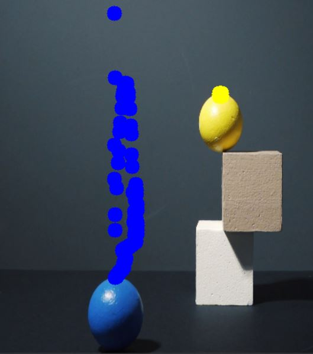

# 🎯 Color Detection and Object Tracking using OpenCV

This project performs color detection and object tracking from a **video file** using the **HSV color space** with **OpenCV**. It detects specified colors and tracks their position across video frames, drawing a visual trail.

---

## 📸 Demo




---

## 🧠 Features

- Real-time color detection from video
- HSV-based color filtering
- Tracks multiple colors simultaneously
- Draws the object's path on video

---

## 🛠 Technologies Used

- Python 3
- OpenCV
- NumPy

---

## 🎨 Color Ranges in HSV

| Color  | HSV Lower            | HSV Upper            |
|--------|----------------------|----------------------|
| Blue   | `[100, 150, 0]`      | `[140, 255, 255]`    |
| Yellow | `[22, 93, 0]`        | `[45, 255, 255]`     |
| Azure  | `[80, 100, 100]`     | `[100, 255, 255]`    |

> These can be changed in the `myColors` list inside the code.

---

## ▶️ How to Run

1. Clone the repository or download the code.
2. Make sure you have Python installed.
3. Install dependencies:

```bash
pip install opencv-python numpy
